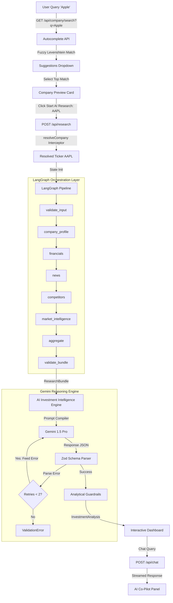

# InvestIQ — AI Investment Research Agent

An institutional-grade, automated equity research platform. InvestIQ orchestrates a multi-stage sequential data pipeline using **LangGraph**, aggregates real-time market data via **Yahoo Finance** and **News API**, and generates verified financial analysis reports using **Gemini** under strict Zod validation schemas.

---

## Features

- **Sequential Pipeline Orchestration** — LangGraph manages 8 nodes: input validation, company profiling, financial collection, news aggregation, competitor mapping, market intelligence, aggregation, and bundle verification.
- **Robust Exception Boundaries** — Every node is wrapped in a try-catch timing loop. A single API failure logs to state and allows the rest of the pipeline to continue.
- **Fact-Strict AI Synthesis** — Custom LangChain output parsers validate Gemini responses against strict Zod schemas. The model is explicitly forbidden from inventing metrics.
- **Auto-Corrective Retries** — On schema failure, the exact Zod error messages are fed back to the model as a correction prompt (up to 2 retries).
- **Analytical Guardrails** — Post-parse checks enforce score consistency, recommendation alignment, SWOT minimums, risk completeness, and summary word limits.
- **Premium Dashboard** — Glassmorphic panels, animated SVG circular score meters, Recharts area/bar charts, and a responsive dark-mode layout.
- **Streaming AI Co-Pilot** — Real-time follow-up chat strictly context-bound to the compiled report.

---

## Technology Stack

| Category | Technology |
|---|---|
| Framework | Next.js 15 (App Router) |
| Language | TypeScript (Strict Mode) |
| Styling | TailwindCSS, Tailwind Animate |
| Orchestration | LangGraph.js, LangChain.js |
| AI Model | Google Gemini 1.5 Pro / Flash |
| Data Sources | Yahoo Finance API, News API |
| Validation | Zod |
| Visualizations | Recharts |
| Animations | Framer Motion |
| State Management | TanStack Query v5, Zustand |
| Testing | Vitest |

---

## Architecture & Data Flow



---

## Folder Structure

```
insideIIM-project/
├── src/
│   ├── app/
│   │   ├── api/
│   │   │   ├── chat/               # Streaming chat API handler
│   │   │   └── research/           # Graph pipeline invocation handler
│   │   ├── (marketing)/            # Landing page layout
│   │   ├── research/               # Dashboard workspace view
│   │   ├── globals.css
│   │   └── layout.tsx
│   ├── agent/
│   │   ├── analysis/               # Synthesis engine, guardrails, output parser
│   │   ├── config/                 # LLM model configuration
│   │   ├── graph/                  # LangGraph nodes, state, helpers, graph.ts
│   │   ├── lib/                    # LLM invocation with retry logic
│   │   ├── prompts/                # Typed prompt builder functions
│   │   ├── schemas/                # Zod schemas (single source of truth for types)
│   │   └── tools/                  # LangChain tool wrappers
│   ├── components/
│   │   ├── layout/                 # Navbar, Footer
│   │   └── shared/                 # Providers, loaders
│   ├── features/
│   │   ├── chat/                   # Co-pilot sidebar components
│   │   ├── dashboard/              # Metric grids, SWOT, risks, competitors
│   │   └── research/               # Pipeline progress tracker
│   ├── lib/                        # API helpers, query client, validators
│   ├── services/                   # Yahoo Finance and News API adapters
│   ├── types/                      # Shared TypeScript types
│   └── utils/                      # Logger, error classes, formatters
├── docs/                           # Architecture, decisions, journals, guides
└── package.json
```

---

## Installation & Setup

**Prerequisites:** Node.js v18+

**1. Install dependencies**
```bash
npm install --legacy-peer-deps
```

**2. Configure environment variables**

Create `.env.local` in the project root:
```env
GEMINI_API_KEY=your_gemini_api_key
NEWS_API_KEY=your_news_api_key
NODE_ENV=development
NEXT_PUBLIC_APP_URL=http://localhost:3000
```

**3. Start the development server**
```bash
npm run dev
```
Open [http://localhost:3000](http://localhost:3000).

**4. Type check**
```bash
npm run type-check
```

**5. Run tests**
```bash
npx vitest run
```

---

## Prompt Engineering & Guardrails

Gemini is governed by strict controls to ensure production-grade reliability:

| Control | Description |
|---|---|
| Zero extrapolation | System prompt explicitly forbids inventing metrics not in the `ResearchBundle` |
| Zod parsers | Outputs are validated against `investmentReportSchema` — wrong types, missing fields, and invalid enums all fail |
| Corrective feedback | Exact Zod error messages are fed back to the model for self-correction |
| Confidence penalty | Missing competitor data, news, or financials automatically reduce the confidence score |
| Verdict alignment | Blocks contradictory outputs (e.g. `"Strong Buy"` with an overall score of 30) |

---

## Documentation

### Core Docs

| Document | Description |
|---|---|
| [System Architecture Overview](docs/system-architecture-overview.md) | Three-tier architecture, end-to-end data flow, orchestration and synthesis layer design |
| [UI Design System & Tokens](docs/ui-design-system-and-tokens.md) | Color palette, typography, spacing, glassmorphic card styles, animation guidelines |
| [Technology Choices & Trade-offs](docs/technology-choices-and-tradeoffs.md) | Technology selection rationale and architectural trade-offs |
| [AI Prompt Design & Guardrails](docs/ai-prompt-design-and-guardrails.md) | Prompt structure, Zod output strategy, retry loop, and all guardrail rules |
| [5-Minute Demo Presentation Script](docs/5-minute-demo-presentation-script.md) | 5-minute step-by-step presentation walkthrough |
| [Final Submission Checklist](docs/final-submission-checklist.md) | Full checklist of source files, documentation, and production readiness items |

### Component Architecture

| Document | Description |
|---|---|
| [LangGraph Pipeline Architecture](docs/architecture/langgraph-pipeline-architecture.md) | Node responsibilities, GraphState schema, merge reducers, state lifecycle |
| [API Request & Response Flow](docs/architecture/api-request-response-flow.md) | Request lifecycle, middleware, response envelopes, error normalization |
| [Investment Intelligence Engine Architecture](docs/architecture/investment-intelligence-engine-architecture.md) | Scoring methodology, guardrail details, retry strategy, output parser |

### Phase Documentation

| Document | Description |
|---|---|
| [Phase 04 — LangGraph Pipeline Deep Dive](docs/phase-04-langgraph-pipeline-deep-dive.md) | Pipeline architecture, node table, GraphState schema, design decisions |
| [Phase 05 — Backend API Layer Deep Dive](docs/phase-05-backend-api-layer-deep-dive.md) | Folder structure, response envelopes, validation rules, middleware responsibilities |
| [Phase 06 — Investment Engine Deep Dive](docs/phase-06-investment-engine-deep-dive.md) | Scoring methodology, guardrail table, retry loop diagram |
| [Phase 07 — UI Dashboard Deep Dive](docs/phase-07-ui-dashboard-deep-dive.md) | Component architecture, animation strategy, accessibility, verification results |

### AI Development Journal

| Document | Description |
|---|---|
| [Journal Master Index](docs/ai-development-journal/journal-master-index.md) | Phase index with status and links to all journal entries |
| [Journal — Phase 01: Project Foundation](docs/ai-development-journal/journal-phase-01-project-foundation.md) | Technology selection, 10 key decisions, trade-offs, challenges, lessons learned |
| [Journal — Phase 04: LangGraph Pipeline](docs/ai-development-journal/journal-phase-04-langgraph-pipeline.md) | Custom reducers, node wrapper, linear vs parallel decision |
| [Journal — Phase 05: Backend API Layer](docs/ai-development-journal/journal-phase-05-backend-api-layer.md) | Middleware pattern, safe body parsing, internal state isolation |
| [Journal — Phase 06: Investment Engine](docs/ai-development-journal/journal-phase-06-investment-engine.md) | Output parser, modular guardrails, retry strategy |
| [Journal — Phase 07: UI Dashboard](docs/ai-development-journal/journal-phase-07-ui-dashboard.md) | Casing conflicts, Recharts SSR, verification results |

### Chat Transcripts

| Document | Description |
|---|---|
| [Full Log: Phase 01 to Final](docs/chat-transcripts/transcript-phase-01-to-final-full-log.md) | Chronological log of key prompts, AI recommendations, and outcomes across all phases |
| [Session: Phase 04 — LangGraph](docs/chat-transcripts/transcript-phase-04-langgraph-session.md) | LangGraph session — linear path, node decorator, completeness verification |
| [Session: Phase 05 — API Layer](docs/chat-transcripts/transcript-phase-05-api-layer-session.md) | API layer session — middleware pattern, safe parsing, state isolation |
| [Session: Phase 06 — Investment Engine](docs/chat-transcripts/transcript-phase-06-investment-engine-session.md) | Synthesis engine session — output parser, guardrails, corrective retries |
| [Session: Phase 07 — UI Dashboard](docs/chat-transcripts/transcript-phase-07-ui-dashboard-session.md) | UI session — glassmorphic dashboard, streaming chat, build verification |

