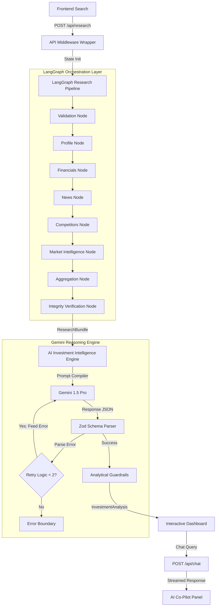

# InvestIQ Investment Research Agent

An institutional-grade, automated equity research platform. This system orchestrates a multi-stage sequential data pipeline using **LangGraph**, aggregates real-time market data via **Yahoo Finance** and **News API**, and generates verified financial analysis reports using **Gemini** under strict validation schemas.

---

## 1. Project Overview & Features

- **Sequential Pipeline Orchestration**: Uses LangGraph to manage validation, company profiling, financial collection, news analysis, competitor mapping, and aggregation.
- **Robust Exception Boundaries**: Wraps graph nodes in automatic timer/try-catch loops to guarantee metadata collection integrity even when third-party endpoints fluctuate.
- **Fact-Strict AI Synthesis**: Implements custom LangChain output parsers to validate Gemini responses against strict Zod schemas.
- **Auto-Corrective Retries**: Re-runs prompts with dynamic error feedback (up to 2 retry attempts) if schemas do not parse cleanly.
- **Analytical Guardrails**: Prevents score anomalies, checks minimum SWOT points, validates horizon timeframes, and enforces executive summary word limits.
- **Premium Startup Interface**: Built with Next.js, TailwindCSS, glassmorphic panels, animated SVG circular score meters, and responsive Recharts.
- **Interactive Co-Pilot Chat**: Streams real-time answers to follow-up questions, restricted strictly to the data present in the compiled report.

---

## 2. Technology Stack

- **Framework**: Next.js 15 (App Router)
- **Language**: TypeScript (Strict Mode)
- **Styling**: TailwindCSS, Tailwind Animate
- **Orchestration**: LangGraph.js, LangChain.js
- **Model Provider**: Google Gemini (via ChatGoogleGenerativeAI)
- **Data Integrations**: Yahoo Finance (via Yahoo Finance API Node client), News API
- **Valuation Schemas**: Zod
- **Visualizations**: Recharts
- **Animations**: Framer Motion
- **Unit Testing**: Vitest

---

## 3. Architecture & Data Flow



---

## 4. Folder Structure

```
insideIIM-project/
├── src/
│   ├── app/                    # Next.js App Router Pages & API Routes
│   │   ├── api/
│   │   │   ├── chat/           # Streaming chat API handler
│   │   │   └── research/       # Graph pipeline invocation handler
│   │   ├── (marketing)/        # Landing Page Layout
│   │   ├── research/           # Workspace & Dashboard Views
│   │   ├── globals.css         # Styling directives and custom tokens
│   │   └── layout.tsx          # Root markup & Query providers
│   ├── agent/                  # AI Intelligence & Orchestration
│   │   ├── analysis/           # Reasoning, guardrails, parser, engine
│   │   ├── graph/              # LangGraph compilation & modular nodes
│   │   ├── schemas/            # Zod validation schemas
│   │   └── types/              # Inferred TypeScript type layouts
│   ├── components/             # Reusable UI widgets
│   │   ├── layout/             # Header, Footer, and Navbar
│   │   └── shared/             # Providers & loaders
│   ├── features/               # Domain-specific UI features
│   │   ├── chat/               # Co-pilot sidebar elements
│   │   ├── dashboard/          # Metric grids, SWOT, news, risks
│   │   └── research/           # Pipeline logs progress tracker
│   ├── lib/                    # Shared API helpers & query configurations
│   ├── services/               # Third-party data adapters
│   └── utils/                  # Formatting, custom logging, and error types
├── docs/                       # Architectural diaries & guides
└── package.json                # Project dependencies
```

---

## 5. Installation & Execution

### Prerequisites
Ensure Node.js v18+ is installed on your local environment.

1. **Clone & Install Dependencies**:
   ```bash
   npm install --legacy-peer-deps
   ```

2. **Configure Environment Variables**:
   Create a `.env.local` file in the root directory:
   ```env
   # API Keys
   GEMINI_API_KEY=your_gemini_api_key
   NEWS_API_KEY=your_news_api_key
   
   # App Environment
   NODE_ENV=development
   NEXT_PUBLIC_APP_URL=http://localhost:3000
   ```

3. **Run the Development Server**:
   ```bash
   npm run dev
   ```
   Open `http://localhost:3000` in your browser.

4. **Run TypeScript Compiler Check**:
   ```bash
   npm run type-check
   ```

5. **Run the Unit Test Suite**:
   ```bash
   npx vitest run
   ```

---

## 6. Prompt Engineering & Guardrails

To ensure production-grade reliability, Gemini models are governed by strict controls:
- **Zero Extrapolation**: System messages explicitly forbid inventing metrics not found in the `ResearchBundle`.
- **Zod Parsers**: Model outputs are parsed via `output-parser.ts` to strip markdown fences and validate JSON keys.
- **Corrective Feedback Loops**: On schemas mismatch, the engine feeds back the exact Zod errors to the model for automatic self-correction.
- **Confidence Penalty**: Evaluates if competitor data, news indexes, or profile details are missing, and automatically deducts confidence points.
- **Verdict Alignment**: Blocks contradictory outputs (e.g. recommendation is "Strong Buy" but financial score is 30).
