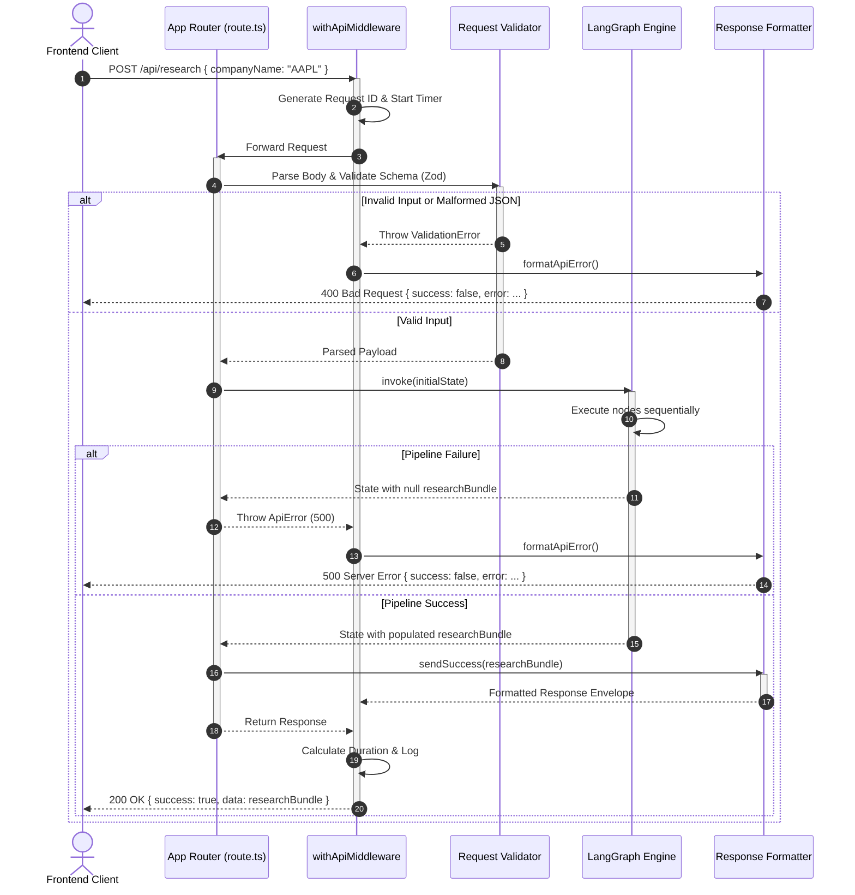

# API Request Flow Architecture

## Request Lifecycle Sequence

## Request-Response Lifecycle Stages
1. **Routing**: Next.js App Router routes the incoming request to the API controller, wrapped by `withApiMiddleware`.
2. **Timing & ID Attachment**: The wrapper captures the start time and attaches a unique Request ID (`X-Request-ID`) to the logging context and final response headers.
3. **Parsing & Validation**: The controller parses JSON safely and validates parameters against the Zod schema. Invalid parameters immediately trigger a `400 Bad Request` response.
4. **Execution**: The controller triggers the compiled LangGraph pipeline. If the pipeline completes successfully, it extracts the aggregated `ResearchBundle`.
5. **Enveloping**: The raw data is mapped to the success JSON envelope, calculating total execution duration.
6. **Logging**: Writes structured details (method, path, HTTP status, request duration, request ID) to the server logger.
