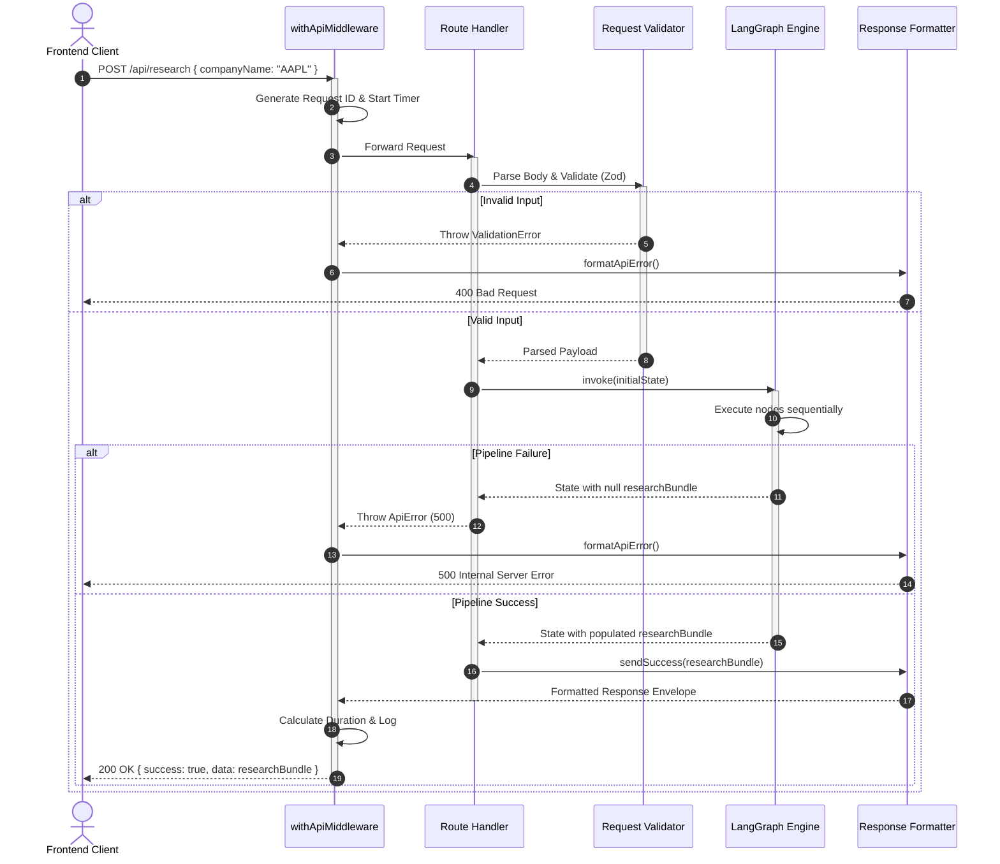

# API Flow Architecture

> The API layer is a thin, structured bridge between the Next.js frontend and the LangGraph execution engine. Its only jobs are to validate inputs, execute the pipeline, and return a clean response envelope.

---

## Request Lifecycle



---

## Folder Structure

```
src/lib/api/
├── config/
│   ├── status-codes.ts     # Centralized HTTP status codes
│   ├── messages.ts         # Centralized response messages
│   └── limits.ts           # Rate limiting configuration
├── errors.ts               # ApiError class and error normalization
├── response.ts             # sendSuccess() and formatApiError() formatters
├── request.ts              # parseJsonBody() and Zod schema validators
└── middleware.ts           # withApiMiddleware higher-order wrapper

src/app/api/
├── research/
│   └── route.ts            # POST /api/research
└── chat/
    └── route.ts            # POST /api/chat (streaming)
```

---

## Response Envelopes

**Success (200)**
```json
{
  "success": true,
  "message": "Research bundle generated successfully",
  "timestamp": "2026-07-11T01:30:00.000Z",
  "executionTime": 2450,
  "data": {
    "company": "AAPL",
    "collectedAt": "2026-07-11T01:30:00.000Z",
    "companyProfile": { "..." },
    "financialData": { "..." },
    "news": ["..."],
    "competitors": ["..."],
    "marketIntelligence": { "..." }
  }
}
```

**Failure (400 / 429 / 500)**
```json
{
  "success": false,
  "error": "Request validation failed",
  "errorCode": "VALIDATION_ERROR",
  "timestamp": "2026-07-11T01:30:00.000Z",
  "details": [
    { "field": "companyName", "message": "Company name is required" }
  ]
}
```

---

## Request Validation Rules

| Field | Rule |
|---|---|
| `companyName` | Required, string, length 1–100 |
| Special characters | Rejects `<`, `>`, `{`, `}`, `[`, `]` to prevent script injection |
| Body format | `parseJsonBody` reads raw text first — prevents runtime crashes on empty or malformed JSON |

---

## Error Normalization

All uncaught exceptions are intercepted inside `withApiMiddleware` and mapped to structured HTTP responses. Stack traces are never exposed in production.

| Error Type | HTTP Status |
|---|---|
| `ZodError` / `ValidationError` | `400 Bad Request` |
| `RateLimitError` | `429 Too Many Requests` |
| Pipeline failure / uncaught exception | `500 Internal Server Error` |

---

## Middleware Responsibilities

`withApiMiddleware` is a higher-order function that wraps every route handler. It handles:

- Generating a unique `X-Request-ID` header for each request
- Recording start time and calculating total execution duration
- Writing structured log lines (method, path, status, duration, request ID)
- Providing a global error boundary so uncaught exceptions never reach the client as unformatted crashes
