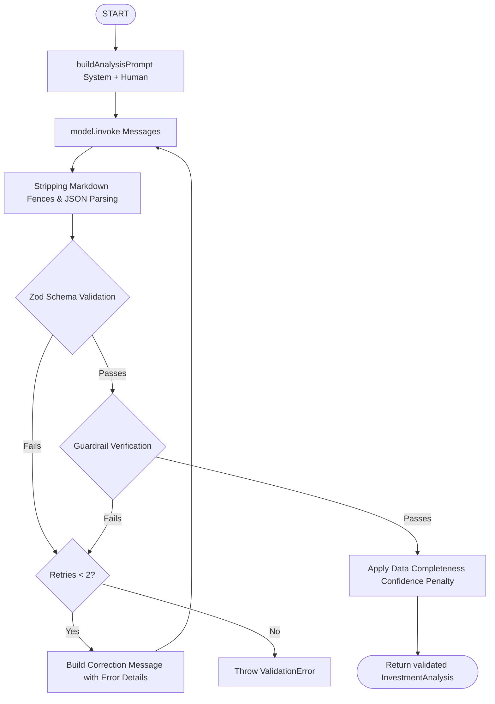

# AI Investment Intelligence Engine Architecture

## Prompts and Parsing Flowchart

## Validation & Retry Strategy Details
1. **JSON Extraction**: The parser uses regular expressions and index boundaries to find the outermost braces `{ ... }`, stripping any markdown decorators (`\`\`\`json`) and conversational noise.
2. **Schema Verification**: Zod checks parameter data types, enum bounds (e.g. risk ratings), and array limits (e.g. SWOT points).
3. **Guardrail Checkers**: Specific modular scripts check the parsed JSON:
   - `summary.ts` checks word count (<= 250 words).
   - `recommendation.ts` checks score-recommendation consistency.
   - `scoring.ts` checks score value boundaries and drift limits.
4. **LLM Error Correction**: On failure, the exact validation error is wrapped in a correction request. This guides the model's next attempt, significantly improving output quality and reducing subsequent failures.
5. **Confidence Adjustment**: If the model claims high confidence (e.g., 90) but the `ResearchBundle` is missing critical financial or competitor metrics, a completeness checker dynamically penalizes the score to prevent overconfidence based on incomplete data.
