# Investment Intelligence Engine Architecture

> The engine takes a structured `ResearchBundle` and produces a validated `InvestmentAnalysis`. It handles prompt compilation, JSON parsing, self-correction retries, and analytical guardrail checks.

---

## Processing Flow

```mermaid
graph TD
    START([ResearchBundle]) --> compile[buildAnalysisPrompt]
    compile --> invoke[model.invoke]
    invoke --> extract[Strip Markdown Fences & JSON.parse]
    extract --> zod{Zod Schema Validation}

    zod -- Fails --> retries{Retries < 2?}
    retries -- Yes --> correction[Build Correction Message with Error Details]
    correction --> invoke
    retries -- No --> error[Throw ValidationError]

    zod -- Passes --> guardrails{Guardrail Checks}
    guardrails -- Fails --> retries

    guardrails -- Passes --> penalty[Apply Confidence Penalty]
    penalty --> END([Return InvestmentAnalysis])
```



---

## Folder Structure

```
src/agent/analysis/
├── investment-engine.ts    # Main engine — prompt compilation, retry loop
├── output-parser.ts        # Markdown stripping, JSON extraction, Zod validation
├── scoring.ts              # Score boundary and consistency checks
├── recommendation.ts       # Score-to-recommendation alignment
├── swot.ts                 # SWOT minimum item count checks
├── risk.ts                 # Risk category completeness checks
├── summary.ts              # Executive summary word count enforcement
└── confidence.ts           # Data completeness confidence penalty
```

---

## Scoring Methodology

Seven scores are generated, each on a 0–100 scale:

| Score | What It Measures |
|---|---|
| Business Quality | Market position, moat strength, operating efficiency |
| Financial Health | Margins, debt-to-equity, liquidity, ROE |
| Growth | Revenue trends, sector expansion, product pipeline |
| Risk | Inverse safety indicator — higher value = higher risk |
| Competitive Advantage | Switching costs, network effects, cost advantages |
| Valuation | P/E, PEG, and relative pricing models |
| Overall Investment Score | Weighted composite — must align with recommendation |

---

## Recommendation Thresholds

| Recommendation | Overall Score Range |
|---|---|
| Strong Buy | ≥ 85 |
| Buy | 70 – 84 |
| Hold | 45 – 69 |
| Avoid | 30 – 44 |
| Strong Avoid | < 30 |

The `recommendation.ts` guardrail blocks any output where the recommendation enum does not match the overall score range.

---

## Output Parser Details

The parser operates in three stages:

1. **Extraction** — Uses regex and index boundaries to find the outermost `{ ... }` block, stripping any markdown fences (` ```json `) and conversational noise.
2. **Parsing** — Calls `JSON.parse` on the extracted string.
3. **Validation** — Runs the parsed object through the `investmentReportSchema` Zod schema, checking data types, enum bounds, and array minimums.

---

## Guardrail Details

| Guardrail | Rule |
|---|---|
| `scoring.ts` | Sub-scores must not drift more than ±20 from the overall score |
| `recommendation.ts` | Recommendation enum must match the overall score threshold band |
| `summary.ts` | Executive summary split by whitespace must be ≤ 250 words |
| `swot.ts` | Each SWOT quadrant array must have ≥ 3 items |
| `risk.ts` | All 8 standard risk categories must be present with a rating and explanation |
| `confidence.ts` | Deducts points for missing competitor data (−20), empty news (−10), missing financials (−15) |

---

## Retry Strategy

- Maximum **2 retries** (3 total attempts).
- On failure, the exact Zod error messages or guardrail violation details are appended to the message history as a correction prompt.
- The model sees its previous bad output and the specific fields that failed — this significantly improves first-retry correction accuracy.
- After 3 failed attempts, a `ValidationError` is thrown and the API returns a `500` response.
