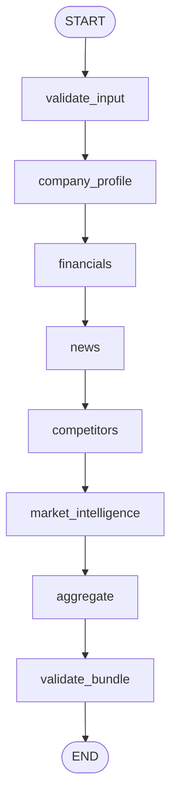

# LangGraph Pipeline Architecture

> The research pipeline is modelled as a sequential directed graph in LangGraph.js. Each node has a single responsibility, and the shared `GraphState` is the only communication channel between nodes.

---

## Execution Flow



---

## Node Responsibilities

| Node | Responsibility |
|---|---|
| `validate_input` | Normalizes ticker to uppercase, rejects invalid characters |
| `company_profile` | Fetches structured company profile via `fetchCompanyProfile` service |
| `financials` | Fetches fundamental financial metrics via `fetchFinancialData` service |
| `news` | Queries recent headlines via `fetchNews` service |
| `competitors` | Fetches profile and financials for peer tickers via `fetchCompetitors` service |
| `market_intelligence` | Gathers macro trends and sector news via `fetchMarketIntelligence` service |
| `aggregate` | Consolidates all fields into a single `ResearchBundle` |
| `validate_bundle` | Filters duplicate news URLs, verifies competitor tickers, raises integrity warnings |

---

## Folder Structure

```
src/agent/graph/
├── state/
│   └── GraphState.ts       # Annotation.Root config, channel types, merge reducers
├── nodes/
│   ├── validate-input.node.ts
│   ├── company-profile.node.ts
│   ├── financials.node.ts
│   ├── news.node.ts
│   ├── competitors.node.ts
│   ├── market-intelligence.node.ts
│   ├── aggregate.node.ts
│   └── validate-bundle.node.ts
├── helpers/
│   └── node-wrapper.ts     # createGraphNode — timing, logging, error boundaries
└── graph.ts                # Compiles and exports the executable graph
```

---

## GraphState Schema

```typescript
interface GraphState {
  companyName: string;
  companyProfile: CompanyProfileData | null;
  financialMetrics: FinancialData | null;
  news: NewsArticle[];
  competitors: CompetitorData[];
  marketIntelligence: MarketIntelligenceData | null;
  researchBundle: ResearchBundle | null;
  nodeStatus: Record<string, NodeStatusType>;
  errors: Record<string, string>;
  warnings: Record<string, string[]>;
  timestamps: Record<string, { startedAt: string; completedAt: string | null }>;
  executionMetadata: ExecutionMetadata;
}
```

---

## State Lifecycle

1. **Instantiation** — `createInitialGraphState` populates `companyName`, records the start timestamp, and sets all fields to their default values.
2. **Running** — For each node, `node-wrapper` sets `nodeStatus[nodeName] = 'running'` and records `timestamps[nodeName].startedAt`.
3. **Success** — Updates `nodeStatus` to `'complete'`, records `completedAt`, and writes data to the node's specific field (e.g. `companyProfile`).
4. **Failure** — Catches the error, writes to `errors[nodeName]`, sets status to `'failed'`, and logs the exception. The pipeline continues.
5. **Aggregation** — The `aggregate` node merges all separate fields into a unified `ResearchBundle`.
6. **Verification** — The `validate_bundle` node checks completeness, deduplicates news by URL, and raises warnings for invalid competitor entries.

---

## Key Design Decisions

**Custom Merge Reducers**
LangGraph overrides parent fields on partial state returns. Dictionary fields (`nodeStatus`, `errors`, `warnings`, `timestamps`, `executionMetadata`) use custom spread reducers that merge new keys into the existing object rather than replacing it. This prevents concurrent or sequential node updates from wiping previously tracked metadata.

**Node Wrapper (`createGraphNode`)**
All eight nodes are wrapped by `createGraphNode`. This helper centralizes timing measurement, status transitions, log output, and error boundaries — keeping individual node files thin and focused purely on their data-fetching logic.

**Linear vs Parallel Execution**
The current graph is strictly sequential. This guarantees deterministic execution trails and simplifies error isolation. A future optimization would run `company_profile`, `financials`, and `news` in parallel using LangGraph branching, then synchronize before `aggregate`.
