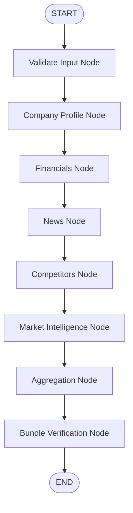

# LangGraph Pipeline Architecture

## Execution Lifecycle Flowchart

## Folder Structure Explanation
- **`state/GraphState.ts`**: Contains the annotation configuration. Utilizes custom reducers for dictionary structures.
- **`nodes/`**: Each file contains the specific business logic for a single pipeline step.
- **`helpers/node-wrapper.ts`**: An orchestrator helper wrapping execution functions. Intercepts errors, updates timestamps, tracks execution duration, and outputs logs.
- **`graph.ts`**: Defines the workflow sequence and compiles the executable graph.

## State Lifecycle Progression
1. **Instantiation**: The client requests a research run. `createInitialGraphState` populates `companyName`, records the starting timestamp, and sets the state variables to default values.
2. **Transitioning (Running State)**: For each node invocation, `node-wrapper` updates `nodeStatus[currentNode]` to `running`, sets `timestamps[currentNode].startedAt`, and updates the current node field.
3. **Completion / Failure**: 
   - On success, updates `nodeStatus` to `complete`, logs execution duration, and writes data to its specific field (e.g. `companyProfile`).
   - On failure, maps the error description to `errors[currentNode]`, sets status to `failed`, and logs the exception.
4. **Final Aggregation**: Merges separate fields into a unified JSON `ResearchBundle`.
5. **Verification**: Checks for data completeness, filters duplicate URLs, and raises final validation alerts if there are invalid competitor entries.
